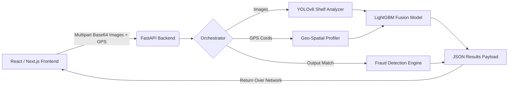

<div align="center">
  
  <h1>🏪 StoreCred AI</h1>
  <p><strong>Next-Gen Computer Vision & Geo-Spatial Underwriting for Kirana Stores</strong></p>

  <p>
    
    
    
    
    
  </p>
</div>

---

## ⚡ Overview

**StoreCred AI** is an advanced, production-ready cash flow underwriting pipeline that estimates the financial health, daily run-rate, and safe EMI bands for small retail "Kirana" stores using entirely **proxy signals**—meaning zero required financial documents from the merchant.

Through image uploads and a GPS ping, the system evaluates:
1. **Visual Inventory Health** (via Computer Vision)
2. **Location Footfall & Competition** (via Geo-Spatial Intelligence)
3. **Cross-Signal Fraud Validation** (via Rule-based heuristics)
4. **Estimated Monthly Income** (via LightGBM fusion model)

---

## 📸 Core Features

### 👁️ Computer Vision Pipeline (`YOLOv8`)
* Analyzes uploaded images (Interior, Counter, Exterior storefront).
* Calculates **Shelf Density Index** and **SKU Diversity**.
* Flags low-light tampering or missing visual evidence.

### 🗺️ Geo-Spatial Intelligence (`GeoPandas`)
* Extrapolates footfall density based on exact Pincode coordinates.
* Analyzes surrounding Points of Interest (POIs) to create a competition density score.
* Merges visual signals with location context to confirm logic.

### 🛡️ Smart Fraud & Contradiction Checker
* Cross-validates data streams (e.g., A store photo with a massive inventory, but a GPS ping in a dead-end rural road gets flagged as high risk for "Staged Evidence").

### 💼 Unified Underwriter Dashboard (`Next.js / React`)
* Built with a stunning, highly-responsive Tailwind CSS UI.
* Transparent breakdown of the exact proxy signals that led to the decision.
* "Scenario Simulator" to allow credit officers to override and stress-test assumptions.

---

## 🏗️ Architecture



---

## 🚀 Deployment

The system is compartmentalized for cost-effective cloud scaling:

### 🌐 Frontend (Vercel)
The UI is built with Next.js and Tailwind CSS (located in the `stre/` directory).
1. Deploy via **Vercel**.
2. Set the *Root Directory* to `stre`.
3. Configure Environment Variable: `NEXT_PUBLIC_API_URL=https://your-backend-url.com`

### 🧠 Backend (Hugging Face Spaces / Docker)
The backend requires substantial RAM for PyTorch/YOLO inference.
1. Deploy as a **Docker Space** on **Hugging Face** (16GB RAM Free Tier).
2. The provided `Dockerfile` automates OpenCV system dependencies and sets up the strict non-root user requirement automatically.

---

## 💻 Local Setup (Development)

**1. Clone the repository**
```bash
git clone https://github.com/Debatreya-sengupta/StoreCred_AI.git
cd StoreCred_AI
```

**2. Start the FastAPI Resource Server**
```bash
# Strongly recommend using a virtual environment
pip install -r requirements.txt
uvicorn backend.main:app --host 0.0.0.0 --port 8000 --reload
```

**3. Start the Next.js Frontend Dashboard**
```bash
cd stre
npm install
NEXT_PUBLIC_API_URL=http://127.0.0.1:8000 npm run dev
```

---
<div align="center">
  <i>Designed for precision micro-lending scale.</i>
</div>
